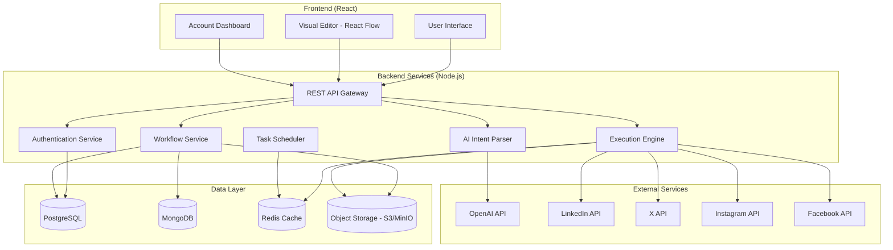

# Design Document: SocialAuto

## Overview

SocialAuto is an AI-driven social media automation platform that bridges the gap between complex developer tools and simple schedulers. The system combines a visual workflow editor with AI-powered automation generation, allowing users to create sophisticated social media posting workflows through natural language or drag-and-drop interfaces.

The platform follows a modular architecture with four core components:
1. **Account Management Hub** - Unified OAuth integration for multiple social platforms
2. **AI Intent Parser** - Natural language to workflow conversion using LLM
3. **Visual Workflow Editor** - React Flow-based canvas for manual workflow creation
4. **Execution Engine** - Automated workflow execution with platform-specific formatting

## Architecture

### High-Level Architecture



### Service Architecture Pattern

The system follows a microservices-inspired modular monolith pattern:
- **API Gateway**: Single entry point handling routing, authentication, and rate limiting
- **Service Layer**: Business logic organized by domain (Auth, Workflow, AI, Execution)
- **Data Layer**: Hybrid storage with PostgreSQL for relational data, MongoDB for document storage, and Object Storage (S3/MinIO) for file assets
- **External Integration Layer**: Abstracted social media platform APIs

## Components and Interfaces

### 1. Authentication Service

**Responsibilities:**
- OAuth 2.0 flow management for social platforms
- Token encryption and secure storage
- Session management and refresh token handling

**Key Interfaces:**

```typescript
interface AuthService {
  initiateOAuth(platform: SocialPlatform, userId: string): Promise<OAuthUrl>
  completeOAuth(code: string, state: string): Promise<AccountConnection>
  refreshTokens(connectionId: string): Promise<void>
  getActiveConnections(userId: string): Promise<AccountConnection[]>
  revokeConnection(connectionId: string): Promise<void>
}

interface AccountConnection {
  id: string
  userId: string
  platform: SocialPlatform
  platformUserId: string
  displayName: string
  accessToken: string // encrypted
  refreshToken: string // encrypted
  expiresAt: Date
  status: 'active' | 'expired' | 'revoked'
  scopes: string[]
  createdAt: Date
  updatedAt: Date
}
```

### 2. AI Intent Parser Service

**Responsibilities:**
- Natural language processing for workflow generation
- LLM integration and prompt engineering
- Structured workflow JSON generation
- AI-generated content creation and file management

**Key Interfaces:**

```typescript
interface AIService {
  parseIntent(prompt: string, userId: string): Promise<WorkflowTemplate>
  generateContent(type: ContentType, parameters: ContentParameters): Promise<GeneratedContent>
  validateWorkflow(workflow: WorkflowTemplate): Promise<ValidationResult>
}

interface GeneratedContent {
  id: string
  type: 'text' | 'image'
  content?: string // For text content
  fileUrl?: string // For image content - S3 URL
  fileName?: string // Original filename
  mimeType?: string // Content type
  metadata: {
    generatedAt: Date
    model: string
    parameters: Record<string, any>
    fileSize?: number // For images
    dimensions?: { width: number; height: number } // For images
  }
}

interface WorkflowTemplate {
  id: string
  name: string
  description: string
  nodes: WorkflowNode[]
  connections: WorkflowConnection[]
  metadata: {
    generatedFrom: 'ai' | 'manual'
    originalPrompt?: string
    createdAt: Date
  }
}

interface WorkflowNode {
  id: string
  type: NodeType
  position: { x: number; y: number }
  data: NodeData
  inputs: NodePort[]
  outputs: NodePort[]
}
```

### 3. Visual Workflow Editor

**Responsibilities:**
- React Flow canvas management
- Node library and validation
- Real-time workflow editing

**Key Components:**

```typescript
interface WorkflowEditor {
  loadWorkflow(workflowId: string): Promise<void>
  saveWorkflow(workflow: WorkflowTemplate): Promise<string>
  addNode(nodeType: NodeType, position: Position): void
  connectNodes(sourceId: string, targetId: string): boolean
  validateConnections(): ValidationResult[]
  exportWorkflow(): WorkflowTemplate
}

interface NodeLibrary {
  triggers: TriggerNode[]
  generators: GeneratorNode[]
  modifiers: ModifierNode[]
  actions: ActionNode[]
}

type NodeType = 
  | 'schedule-trigger'
  | 'manual-trigger'
  | 'webhook-trigger'
  | 'ai-text-generator'
  | 'ai-image-generator'
  | 'image-resizer'
  | 'text-formatter'
  | 'linkedin-publisher'
  | 'twitter-publisher'
  | 'instagram-publisher'
  | 'facebook-publisher'
```

### 4. Execution Engine

**Responsibilities:**
- Workflow execution orchestration
- Platform-specific content formatting
- Task scheduling and queue management
- File asset management during execution

**Key Interfaces:**

```typescript
interface ExecutionEngine {
  executeWorkflow(workflowId: string, trigger?: TriggerData): Promise<ExecutionResult>
  scheduleWorkflow(workflowId: string, schedule: CronExpression): Promise<string>
  cancelScheduledWorkflow(scheduleId: string): Promise<void>
  getExecutionHistory(workflowId: string): Promise<ExecutionLog[]>
}

interface PlatformPublisher {
  publish(content: FormattedContent, connection: AccountConnection): Promise<PublishResult>
  formatContent(content: RawContent, platform: SocialPlatform): FormattedContent
  validateContent(content: FormattedContent): ValidationResult
}

interface FileStorageService {
  uploadFile(file: Buffer, fileName: string, contentType: string, userId: string): Promise<FileUploadResult>
  getFile(fileUrl: string): Promise<Buffer>
  generatePresignedUrl(fileUrl: string, expiresIn?: number): Promise<string>
  deleteFile(fileUrl: string): Promise<void>
  resizeImage(fileUrl: string, dimensions: ImageDimensions): Promise<string>
}

interface FileUploadResult {
  fileUrl: string
  fileName: string
  fileSize: number
  contentType: string
  uploadedAt: Date
}

interface FormattedContent {
  text?: string
  imageUrls?: string[] // S3 URLs for images
  videoUrls?: string[] // S3 URLs for videos
  metadata: {
    platform: SocialPlatform
    originalContent: RawContent
    transformations: ContentTransformation[]
  }
}

interface ExecutionResult {
  executionId: string
  workflowId: string
  status: 'success' | 'partial' | 'failed'
  startedAt: Date
  completedAt: Date
  nodeResults: NodeExecutionResult[]
  errors: ExecutionError[]
}
```

## Data Models

### PostgreSQL Schema (Relational Data)

```sql
-- Users and Authentication
CREATE TABLE users (
    id UUID PRIMARY KEY DEFAULT gen_random_uuid(),
    email VARCHAR(255) UNIQUE NOT NULL,
    password_hash VARCHAR(255) NOT NULL,
    display_name VARCHAR(100),
    created_at TIMESTAMP DEFAULT NOW(),
    updated_at TIMESTAMP DEFAULT NOW()
);

-- Social Media Account Connections
CREATE TABLE account_connections (
    id UUID PRIMARY KEY DEFAULT gen_random_uuid(),
    user_id UUID REFERENCES users(id) ON DELETE CASCADE,
    platform VARCHAR(20) NOT NULL, -- 'linkedin', 'twitter', 'instagram', 'facebook'
    platform_user_id VARCHAR(100) NOT NULL,
    display_name VARCHAR(100),
    access_token_encrypted TEXT NOT NULL,
    refresh_token_encrypted TEXT,
    expires_at TIMESTAMP,
    status VARCHAR(20) DEFAULT 'active', -- 'active', 'expired', 'revoked'
    scopes TEXT[], -- Array of granted permissions
    created_at TIMESTAMP DEFAULT NOW(),
    updated_at TIMESTAMP DEFAULT NOW(),
    UNIQUE(user_id, platform, platform_user_id)
);

-- Workflow Metadata (references MongoDB documents)
CREATE TABLE workflows (
    id UUID PRIMARY KEY DEFAULT gen_random_uuid(),
    user_id UUID REFERENCES users(id) ON DELETE CASCADE,
    name VARCHAR(200) NOT NULL,
    description TEXT,
    mongo_document_id VARCHAR(24) NOT NULL, -- Reference to MongoDB document
    status VARCHAR(20) DEFAULT 'draft', -- 'draft', 'active', 'paused', 'archived'
    generated_from VARCHAR(10) DEFAULT 'manual', -- 'ai', 'manual'
    original_prompt TEXT, -- Store original AI prompt if applicable
    created_at TIMESTAMP DEFAULT NOW(),
    updated_at TIMESTAMP DEFAULT NOW()
);

-- Scheduled Executions
CREATE TABLE workflow_schedules (
    id UUID PRIMARY KEY DEFAULT gen_random_uuid(),
    workflow_id UUID REFERENCES workflows(id) ON DELETE CASCADE,
    cron_expression VARCHAR(100) NOT NULL,
    timezone VARCHAR(50) DEFAULT 'UTC',
    next_execution TIMESTAMP,
    is_active BOOLEAN DEFAULT true,
    created_at TIMESTAMP DEFAULT NOW(),
    updated_at TIMESTAMP DEFAULT NOW()
);

-- Execution History
CREATE TABLE workflow_executions (
    id UUID PRIMARY KEY DEFAULT gen_random_uuid(),
    workflow_id UUID REFERENCES workflows(id) ON DELETE CASCADE,
    schedule_id UUID REFERENCES workflow_schedules(id) ON DELETE SET NULL,
    status VARCHAR(20) NOT NULL, -- 'running', 'success', 'partial', 'failed'
    started_at TIMESTAMP DEFAULT NOW(),
    completed_at TIMESTAMP,
    execution_data JSONB, -- Store execution results and errors
    created_at TIMESTAMP DEFAULT NOW()
);

-- File Assets (for generated content)
CREATE TABLE file_assets (
    id UUID PRIMARY KEY DEFAULT gen_random_uuid(),
    user_id UUID REFERENCES users(id) ON DELETE CASCADE,
    file_url VARCHAR(500) NOT NULL, -- S3 URL
    file_name VARCHAR(255) NOT NULL,
    file_size BIGINT NOT NULL,
    content_type VARCHAR(100) NOT NULL,
    metadata JSONB, -- Store dimensions, generation parameters, etc.
    created_at TIMESTAMP DEFAULT NOW(),
    expires_at TIMESTAMP, -- Optional expiration for temporary files
    INDEX(user_id, created_at),
    INDEX(expires_at) -- For cleanup jobs
);
```

### MongoDB Schema (Document Data)

```typescript
// Workflow Documents (stored in MongoDB)
interface WorkflowDocument {
  _id: ObjectId
  workflowId: string // References PostgreSQL workflows.id
  version: number
  nodes: WorkflowNode[]
  connections: WorkflowConnection[]
  settings: {
    autoSave: boolean
    notifications: boolean
    retryPolicy: {
      maxRetries: number
      backoffStrategy: 'linear' | 'exponential'
    }
  }
  createdAt: Date
  updatedAt: Date
}

interface WorkflowNode {
  id: string
  type: NodeType
  position: { x: number; y: number }
  data: NodeData
  inputs: NodePort[]
  outputs: NodePort[]
  config: Record<string, any> // Node-specific configuration
}

interface WorkflowConnection {
  id: string
  sourceNodeId: string
  sourcePortId: string
  targetNodeId: string
  targetPortId: string
  metadata?: {
    label?: string
    color?: string
  }
}

// Node-specific data structures
interface ScheduleTriggerData extends NodeData {
  cronExpression: string
  timezone: string
  enabled: boolean
}

interface AITextGeneratorData extends NodeData {
  prompt: string
  model: 'gpt-3.5-turbo' | 'gpt-4'
  maxTokens: number
  temperature: number
  systemPrompt?: string
}

interface AIImageGeneratorData extends NodeData {
  prompt: string
  model: 'dall-e-2' | 'dall-e-3' | 'stable-diffusion'
  size: '256x256' | '512x512' | '1024x1024' | '1792x1024' | '1024x1792'
  quality: 'standard' | 'hd'
  style?: 'vivid' | 'natural'
}

interface ImageResizerData extends NodeData {
  targetDimensions: { width: number; height: number }
  maintainAspectRatio: boolean
  quality: number // 1-100
  format: 'jpeg' | 'png' | 'webp'
}

interface PlatformPublisherData extends NodeData {
  accountConnectionId: string
  contentTemplate: string
  publishImmediately: boolean
  scheduledTime?: Date
  attachments?: {
    imageUrls: string[] // S3 URLs
    videoUrls: string[] // S3 URLs
  }
}
```

### Redis Schema (Cache and Queue Data)

```typescript
// Task Queue Structure (using BullMQ)
interface WorkflowExecutionJob {
  workflowId: string
  executionId: string
  triggerData?: any
  userId: string
  priority: number
  attempts: number
  delay?: number
}

// Cache Keys
interface CacheKeys {
  userSessions: `session:${string}` // User session data
  workflowCache: `workflow:${string}` // Cached workflow documents
  rateLimits: `rate:${string}:${string}` // Rate limiting counters
  oauthStates: `oauth:${string}` // OAuth state parameters
  executionLocks: `lock:execution:${string}` // Prevent duplicate executions
  fileCache: `file:${string}` // Temporary file metadata cache
}
```

## API Design

### REST API Endpoints

```typescript
// Authentication Endpoints
POST   /api/auth/register
POST   /api/auth/login
POST   /api/auth/logout
GET    /api/auth/me
POST   /api/auth/refresh

// Social Account Management
GET    /api/accounts/connections
POST   /api/accounts/oauth/initiate
POST   /api/accounts/oauth/callback
DELETE /api/accounts/connections/:id
POST   /api/accounts/connections/:id/refresh

// Workflow Management
GET    /api/workflows
POST   /api/workflows
GET    /api/workflows/:id
PUT    /api/workflows/:id
DELETE /api/workflows/:id
POST   /api/workflows/:id/duplicate

// AI Intent Parser
POST   /api/ai/parse-intent
POST   /api/ai/generate-content
POST   /api/ai/validate-workflow

// Workflow Execution
POST   /api/workflows/:id/execute
GET    /api/workflows/:id/executions
POST   /api/workflows/:id/schedule
GET    /api/workflows/:id/schedules
DELETE /api/schedules/:id

// Node Library
GET    /api/nodes/library
GET    /api/nodes/types/:type/schema

// File Management
POST   /api/files/upload
GET    /api/files/:id
DELETE /api/files/:id
POST   /api/files/:id/resize
GET    /api/files/:id/presigned-url
```

### WebSocket Events

```typescript
// Real-time workflow editor events
interface WorkflowEditorEvents {
  'workflow:node:added': { nodeId: string; node: WorkflowNode }
  'workflow:node:updated': { nodeId: string; changes: Partial<WorkflowNode> }
  'workflow:node:deleted': { nodeId: string }
  'workflow:connection:created': { connection: WorkflowConnection }
  'workflow:connection:deleted': { connectionId: string }
  'workflow:execution:started': { executionId: string }
  'workflow:execution:completed': { executionId: string; result: ExecutionResult }
  'workflow:validation:error': { errors: ValidationError[] }
}
```
## Correctness Properties

*A property is a characteristic or behavior that should hold true across all valid executions of a system—essentially, a formal statement about what the system should do. Properties serve as the bridge between human-readable specifications and machine-verifiable correctness guarantees.*

### Property Reflection

After analyzing the acceptance criteria, I identified several properties that can be consolidated:
- OAuth flow properties can be combined into a comprehensive OAuth compliance property
- Node connection validation can be unified into a single connection validation property  
- Platform formatting properties can be consolidated into a comprehensive content formatting property
- Execution logging can be combined with scheduling into execution tracking properties

### Core Properties

**Property 1: OAuth 2.0 Compliance**
*For any* supported social platform (LinkedIn, X, Instagram, Facebook) and any valid OAuth request, the system should complete the OAuth 2.0 flow according to specification and return valid access tokens
**Validates: Requirements 2.1.1**

**Property 2: Token Encryption Security**
*For any* access or refresh token stored in the system, the stored value should be encrypted and not readable in plaintext from the database
**Validates: Requirements 2.1.2**

**Property 3: Connection Status Accuracy**
*For any* user account with social media connections, the dashboard display should accurately reflect the actual connection status (active/expired) based on token validity
**Validates: Requirements 2.1.3**

**Property 4: AI Workflow Generation**
*For any* valid natural language workflow description, the AI parser should generate a valid JSON workflow configuration with properly structured nodes and connections
**Validates: Requirements 2.2.2**

**Property 5: Intent-Based Node Instantiation**
*For any* parsed workflow intent, the system should instantiate the correct node types that match the described functionality (e.g., scheduling intent creates schedule nodes)
**Validates: Requirements 2.2.3**

**Property 6: Visual Editor Operations**
*For any* sequence of valid canvas operations (add node, move node, connect nodes), the visual editor should maintain a consistent and valid workflow state
**Validates: Requirements 2.3.1**

**Property 7: Node Connection Validation**
*For any* attempted node connection, the system should accept valid connections (compatible input/output types) and reject invalid connections with appropriate error messages
**Validates: Requirements 2.3.3**

**Property 8: Platform-Specific Content Formatting**
*For any* content and target social platform, the system should automatically format the content to meet platform-specific constraints (character limits, image dimensions, etc.)
**Validates: Requirements 2.4.1**

**Property 9: Scheduled Execution Accuracy**
*For any* scheduled workflow with a valid cron expression, the system should execute the workflow within an acceptable time window of the scheduled time
**Validates: Requirements 2.4.2**

**Property 10: Execution History Completeness**
*For any* workflow execution (successful or failed), the system should create a complete log entry that includes execution status, timestamps, and error details if applicable
**Validates: Requirements 2.4.3**

## Error Handling

### Error Categories and Strategies

**1. Authentication Errors**
- **OAuth Failures**: Graceful fallback with user-friendly error messages and retry mechanisms
- **Token Expiration**: Automatic refresh token usage with fallback to re-authentication prompt
- **Platform API Errors**: Rate limiting respect and exponential backoff for temporary failures

**2. AI Processing Errors**
- **LLM API Failures**: Fallback to cached responses or simplified parsing for common patterns
- **Invalid Intent Parsing**: Clear error messages with suggestions for rephrasing
- **Content Generation Failures**: Graceful degradation to template-based content

**3. Workflow Execution Errors**
- **Node Execution Failures**: Isolated error handling preventing cascade failures
- **Platform Publishing Errors**: Retry logic with exponential backoff and dead letter queues
- **Scheduling Errors**: Automatic rescheduling with failure notifications

**4. Data Consistency Errors**
- **Database Connection Failures**: Connection pooling and automatic reconnection
- **Transaction Failures**: Rollback mechanisms and data integrity checks
- **Cache Inconsistencies**: Cache invalidation strategies and fallback to source data

### Error Recovery Mechanisms

```typescript
interface ErrorRecoveryStrategy {
  retryPolicy: {
    maxRetries: number
    backoffStrategy: 'linear' | 'exponential'
    retryableErrors: ErrorCode[]
  }
  fallbackStrategy: {
    enableFallback: boolean
    fallbackAction: 'cache' | 'template' | 'notify' | 'skip'
  }
  notificationStrategy: {
    notifyUser: boolean
    notifyAdmin: boolean
    severity: 'low' | 'medium' | 'high' | 'critical'
  }
}
```

## Testing Strategy

### Dual Testing Approach

The testing strategy combines unit tests for specific scenarios with property-based tests for comprehensive coverage:

**Unit Tests Focus:**
- Specific OAuth flow scenarios for each platform
- Edge cases in AI prompt parsing (empty prompts, malformed input)
- Platform-specific content formatting edge cases
- Error condition handling and recovery mechanisms
- Integration points between services

**Property-Based Tests Focus:**
- Universal properties that hold across all inputs
- Comprehensive input coverage through randomization
- Workflow generation and validation across diverse prompts
- Content formatting across various content types and platforms
- Connection validation across all possible node combinations

### Property-Based Testing Configuration

**Framework Selection:**
- **JavaScript/TypeScript**: fast-check library for property-based testing
- **Minimum 100 iterations** per property test due to randomization requirements
- **Test tagging format**: `Feature: social-media-automation, Property {number}: {property_text}`

**Test Categories:**

1. **Authentication Properties**
   - OAuth flow compliance across platforms
   - Token encryption and security validation
   - Connection status accuracy verification

2. **AI Processing Properties**
   - Workflow generation from natural language
   - Node instantiation correctness
   - JSON structure validation

3. **Visual Editor Properties**
   - Canvas operation consistency
   - Node connection validation
   - Workflow state integrity

4. **Execution Engine Properties**
   - Platform-specific formatting compliance
   - Scheduled execution timing accuracy
   - Execution logging completeness

### Integration Testing Strategy

**End-to-End Workflows:**
- Complete user journey from account connection to content publishing
- AI-generated workflow execution across multiple platforms
- Error recovery and retry mechanisms under various failure conditions

**Performance Testing:**
- Concurrent workflow execution scalability
- AI processing response time validation
- Database query optimization verification

**Security Testing:**
- Token encryption and secure storage validation
- OAuth flow security compliance
- API rate limiting and abuse prevention

### Test Data Management

**Mock Data Generation:**
- Realistic social media content samples
- Diverse natural language workflow descriptions
- Various platform-specific constraints and limitations
- Simulated API responses for external services

**Test Environment Isolation:**
- Separate test databases with realistic data volumes
- Mock external API services (social platforms, OpenAI)
- Isolated execution environments for concurrent testing

This comprehensive testing strategy ensures both correctness of individual components and system-wide reliability under various conditions and input scenarios.